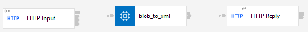

# HTTP BLOB TO XML

## Project Description

This project involves creating a flow that handles HTTP requests at the `/blob_to_xml` path. The goal is to receive a message in BLOB format, parse it into XML, fill certain fields, and return the modified XML message in the HTTP response.

## Requirements

1. **Input Format**: The input message must be in BLOB format.
2. **Parsing**: The BLOB message must be parsed into XML.
3. **Fields to Fill**: 
    - `email`
    - `firstname`
    - `lastname`
    - `middlename`
    - `mobilePhone`
4. **Response**: The final XML message must be displayed in the HTTP response.

## Input Message

The format of the input message is as follows:

```xml
<warehouseAddress>
    <id>715837886</id>
    <nickname>STLUSEFFM_FulfillmentCenterLocation</nickname>
    <email/>
    <firstname/>
    <lastname/>
    <middlename/>
    <mobilePhone/>
    <address>Engelhard Ave, 34</address>
    <zipcode>07001</zipcode>
    <geocode>310236556</geocode>
    <city>Avenel</city>
    <state>New Jersey</state>
    <stateISO>US-NJ</stateISO>
    <country>United States</country>
    <countryISO>US</countryISO>
</warehouseAddress>
```

## Project Flow

### Flow Design

1. **Receiving the HTTP Message in BLOB Format**: The HTTP server receives a request at the `/blob_to_xml` path with the message body in BLOB format.
2. **Parsing the BLOB to XML**: The message in BLOB format is converted to an XML document.
3. **Filling Fields**: The `email`, `firstname`, `lastname`, `middlename`, and `mobilePhone` fields of the XML are filled with appropriate values.
4. **HTTP Response**: The modified XML document is sent back to the client in the HTTP response.

### Flow Design Screenshot



## Installation and Execution

1. **Clone the repository**:
    ```sh
    git clone https://github.com/ManuelCobos24/IIB-APP-CONNECT.git
    ```
2. **Navigate to the project directory**:
    ```sh
    cd BLOB_TO_XML
    ```
3. **Open the project in IBM IIB App Connect Enterprise Toolkit**.

## Usage

1. **Send an HTTP Request**:
    Send an HTTP POST request to `http://HOST:PORT/blob_to_xml` with the message in BLOB format in the request body.
2. **Receive the Response**:
    The response will be an XML document with the `email`, `firstname`, `lastname`, `middlename`, and `mobilePhone` fields filled.

## Contributions

Contributions are welcome. Please open an issue or submit a pull request.