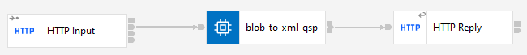

# HTTP BLOB TO XML

## Project Description

This project involves creating an application named "BLOB_TO_XML_QS_&_P" to handle HTTP requests with the path `/blob_to_xml_qsp/Middlename:/*/mobilephone:*`. The goal is to receive a BLOB-formatted message, parse it into XML, fill specific fields from both QueryString parameters and path parameters (`Middlename` and `mobilephone`), and return the modified XML message in the HTTP response.

## Requirements

1. **Input Format**: The input message must be in BLOB format.
2. **Parsing**: Convert the BLOB message into XML format.
3. **Fields to Fill**: 
    - `Email`: From QueryString
    - `Firstname`: From QueryString
    - `Lastname`: From QueryString
    - `Middlename`: From path parameter (`Middlename`)
    - `mobilePhone`: From path parameter (`mobilephone`)
4. **Response**: The final XML message with all fields filled must be returned in the HTTP response.

## Input Message

The format of the input message is as follows:

```xml
<warehouseAddress>
    <id>715837886</id>
    <nickname>STLUSEFFM_FulfillmentCenterLocation</nickname>
    <email/>
    <firstname/>
    <lastname/>
    <middlename/>
    <mobilePhone/>
    <address>Engelhard Ave, 34</address>
    <zipcode>07001</zipcode>
    <geocode>310236556</geocode>
    <city>Avenel</city>
    <state>New Jersey</state>
    <stateISO>US-NJ</stateISO>
    <country>United States</country>
    <countryISO>US</countryISO>
</warehouseAddress>
```

## Project Flow

### Flow Design

1. **Receiving the HTTP Message in BLOB Format**: The HTTP server receives a request at the `/blob_to_xml_qsp/Middlename:/*/mobilephone:*` path with the message body in BLOB format.
2. **Parsing the BLOB to XML**: Parse the BLOB message into an XML document.
3. **Filling Fields**: Populate the `email`, `firstname`, `lastname`, `middlename`, and `mobilePhone` fields in the XML document with appropriate values from the QueryString and path parameters.
4. **HTTP Response**: Send the modified XML document in the HTTP response.

### Flow Design Screenshot



## Installation and Execution

1. **Clone the repository**:
    ```sh
    git clone https://github.com/ManuelCobos24/IIB-APP-CONNECT.git
    ```
2. **Navigate to the project directory**:
    ```sh
    cd BLOB_TO_XML_QS_&_P
    ```
3. **Open the project in your preferred IDE or editor**.

## Usage

1. **Send an HTTP Request**:
    Send an HTTP POST request to `http://localhost:7801/blob_to_xml_qsp/Middlename:/Cobos/mobilephone:/626736834?Email=manuel.cobos@viewnext.es&Firstname=Manuel&Lastname=Solis`.
2. **Receive the Response**:
    The response will be an XML document with the `email`, `firstname`, `lastname`, `middlename`, and `mobilePhone` fields filled.

## Contributions

Contributions are welcome. Please open an issue or submit a pull request.