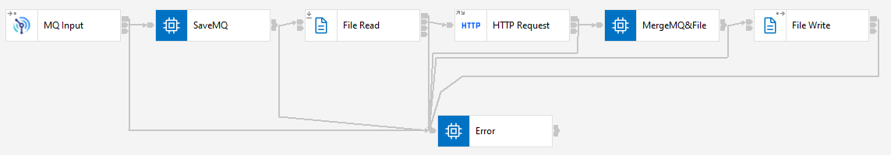
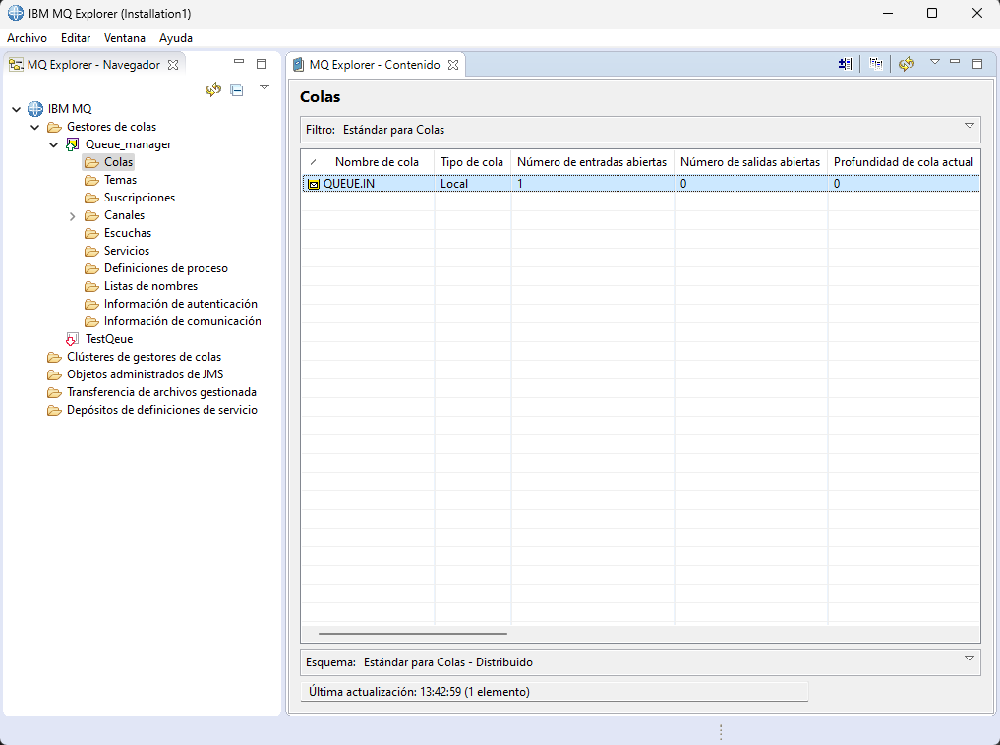

# MERGE_MQ_&_FILE_XML

## Project Description

This project involves creating an application named "MERGE_MQ_&_FILE_XML" that integrates messaging and file handling capabilities. The application performs the following tasks:

1. Reads a message from the queue named "QUEUE.IN" with the following format:
   ```xml
   <Input>
       <message>Queue message from QUEUE.IN</message>
   </Input>
   ```

2. Reads an XML file named `In.xml` from a specified path.
   
3. Invokes a HTTPRequest node to call the flow from "BLOB_TO_XML/blob_to_xml.esql" with the XML content read from step 2.

4. Constructs an XML file named `Out.xml` that combines:
   - The content from step 1 (`<Input>`) of the message read from the queue.
   - The XML response received from the HTTPRequest node in step 3, which includes:
     ```xml
     <warehouseAddress>
         <id>715837886</id>
         <nickname>STLUSEFFM_FulfillmentCenterLocation</nickname>
         <email/>
         <firstname/>
         <lastname/>
         <middlename/>
         <mobilePhone/>
         <address>Engelhard Ave, 34</address>
         <zipcode>07001</zipcode>
         <geocode>310236556</geocode>
         <city>Avenel</city>
         <state>New Jersey</state>
         <stateISO>US-NJ</stateISO>
         <country>United States</country>
         <countryISO>US</countryISO>
     </warehouseAddress>
     ```

5. Saves the constructed XML (`<File>`) to a specified path.

## Project Components

### Flow Design Screenshot



### Flow Design

1. **Reading from MQ Queue**:
   - Reads XML messages from the queue named "QUEUE.IN".

2. **Reading File (In.xml)**:
   - Reads XML content from the file `In.xml`.

3. **Invoking HTTPRequest to Ejercicio1_ManuelCobos**:
   - Invokes an HTTPRequest node to send the XML content read from `In.xml` to the flow in "BLOB_TO_XML/blob_to_xml.esql".

4. **Constructing Output XML (Out.xml)**:
   - Constructs an XML (`<File>`) that combines the message from the MQ queue and the response XML from the HTTPRequest.

### Flow Design Screenshots



## Installation and Execution

1. **Clone the repository**:
    ```sh
    git clone https://github.com/ManuelCobos24/IIB-APP-CONNECT.git
    ```
2. **Navigate to the project directory**:
    ```sh
    cd MERGE_MQ_&_FILE_XML
    ```
3. **Open the project in your preferred IDE or editor**.
4. **Send the default message from MQ Explorer**

## Usage

1. **Message Queue (QUEUE.IN)**:
   - Messages in the format `<Input><message>Queue message from QUEUE.IN</message></Input>` will trigger the flow.

2. **Input File (In.xml)**:
   - Ensure `In.xml` exists at the configured path with valid XML content.

3. **Output File (Out.xml)**:
   - The merged XML (`<File>`) will be saved to the specified path after processing.

## Contributions

Contributions are welcome. Please open an issue or submit a pull request.